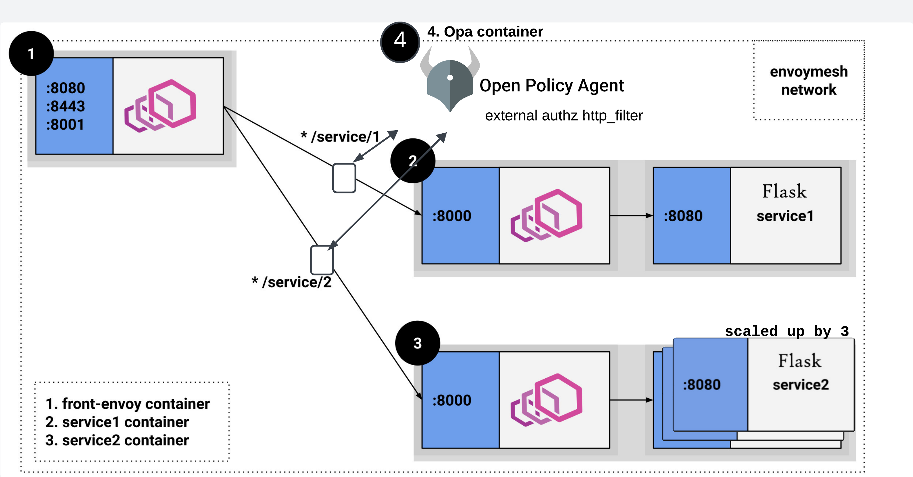

# Guia Envoy
Nesse guia nós contruíremos nossa `envoymesh` com três services envoy rodando, uma como front-envoy na borda da aplicação (como esse guia em blog na aws, [Setting Up an Envoy Front Proxy on Amazon ECS](https://aws.amazon.com/pt/blogs/compute/setting-up-an-envoy-front-proxy-on-amazon-ecs/)) e os outros dois como sidecar de um serviço flask rodando. Ainda colocaremos um serviço externo para authorizar requests.

Veja o esquema abaixo: 


## Instalação

Um pré-requisito para esse guia é rodar Docker em sua máquina, veja [Install Docker Engine](https://docs.docker.com/engine/install/).

### Clonar o Repositório

Para começar, clone o repositório do projeto para sua máquina local:

```bash
git clone https://github.com/AbraaoCF/envoy-guide
``` 
### Executar Docker Compose

Após clonar o repositório, navegue até o diretório do projeto e execute o comando Docker Compose para construir e iniciar os contêineres:

```bash
cd envoy-guide
docker-compose up --build -d
``` 
> <i>Destaque: </i> perceba que utilizamos uma imagem do `Dockerfile-OPA`, uma imagem envoy definida no `./docker-compose.yaml` e outra imagem para os serviços Python definida em `./python/Dockerfile`.

Foram expostas três portas para acessarmos o nosso front-envoy: 
```
- "${PORT_PROXY:-8080}:8080"
- "${PORT_HTTPS:-8443}:8443"
- "${PORT_STATS:-8001}:8001"
```

## Passo-a-passo

### Rodar o GET através do envoy
Agora que o projeto está configurado e em execução, teste as nossas <b>rotas GET</b>.
> <b> <i> Destaque: </i> Perceba que temos dois listeners definidos no nosso arquivo de configuração envoy.yaml: </b> 
```
  listeners:
  - address:
      socket_address:
        address: 0.0.0.0
        port_value: 8080
    ....
  - address:
      socket_address:
        address: 0.0.0.0
        port_value: 8443
```

O objetivo agora é testar o sistema com front-proxy e alcancar o mesmo IP executando a chamada HTTP pela porta `8080` e HTTPS pela porta `8443` para um mesmo serviço (verifique o campo de saída `resolved`):

#### Get HTTP:
```bash
curl -v localhost:8080/service/1
```

```
*  Trying 127.0.0.1:8080...
* Connected to localhost (127.0.0.1) port 8080 (#0)
> GET /service/1 HTTP/1.1
> Host: localhost:8080
> User-Agent: curl/8.1.2
> Accept: */*
> 
< HTTP/1.1 200 OK
< content-type: text/plain; charset=utf-8
< content-length: 83
< date: Thu, 02 May 2024 18:11:02 GMT
< server: envoy
< x-envoy-upstream-service-time: 99
< 
Hello Anonymous OPA from behind Envoy 1!
hostname 6c0898c665f1
resolved 172.23.0.3
* Connection #0 to host localhost left intact
```
#### Get HTTPS:
```bash
curl -v -k https://localhost:8443/service/1
```

```
*   Trying 127.0.0.1:8443...
* Connected to localhost (127.0.0.1) port 8443 (#0)
* ALPN: offers h2,http/1.1
* (304) (OUT), TLS handshake, Client hello (1):
* (304) (IN), TLS handshake, Server hello (2):
* (304) (IN), TLS handshake, Unknown (8):
* (304) (IN), TLS handshake, Certificate (11):
* (304) (IN), TLS handshake, CERT verify (15):
* (304) (IN), TLS handshake, Finished (20):
* (304) (OUT), TLS handshake, Finished (20):
* SSL connection using TLSv1.3 / AEAD-AES256-GCM-SHA384
* ALPN: server did not agree on a protocol. Uses default.
* Server certificate:
*  subject: CN=front-envoy
*  start date: Jul  8 01:31:46 2020 GMT
*  expire date: Jul  6 01:31:46 2030 GMT
*  issuer: CN=front-envoy
*  SSL certificate verify result: self signed certificate (18), continuing anyway.
* using HTTP/1.x
> GET /service/1 HTTP/1.1
> Host: localhost:8443
> User-Agent: curl/8.1.2
> Accept: */*
> 
< HTTP/1.1 200 OK
< content-type: text/plain; charset=utf-8
< content-length: 83
< date: Thu, 02 May 2024 23:55:09 GMT
< server: envoy
< x-envoy-upstream-service-time: 2
< 
Hello Anonymous OPA from behind Envoy 1!
hostname 6c0898c665f1
resolved 172.23.0.3
* Connection #0 to host localhost left intact
```

Temos conexão com o serviço através dos dois protocolos, teste para o `/service/2 `e o resultado deve ser o semelhante.

#

### Load Balance no Envoy

Agora o objetivo será testar a distribuição de carga feita pelo proxy quando temos um microsserviço escalado horizontalmente.

#### Replique um serviço

```bash
docker-compose up -d --scale service1=3
```

#### Execute chamadas ao serviço
Com as réplicas do service funcionando normalmente, teste fazer o GET múltiplas vezes e perceba a mudança no endereco IP.

```bash
curl -v localhost:8080/service/1
```

Exemplos:
```
...
< x-envoy-upstream-service-time: 1
< 
Hello Anonymous OPA from behind Envoy 1!
hostname a9ee19bd28d3
resolved 172.23.0.8
* Connection #0 to host localhost left intact
```
```
...
< x-envoy-upstream-service-time: 1
< 
Hello Anonymous OPA from behind Envoy 1!
hostname a9ee19bd28d3
resolved 172.23.0.9
* Connection #0 to host localhost left intact
```
```
...
< x-envoy-upstream-service-time: 1
< 
Hello Anonymous OPA from behind Envoy 1!
hostname a9ee19bd28d3
resolved 172.23.0.3
* Connection #0 to host localhost left intact
```

> <i> Destaque: </i>Note que não precisamos alterar o arquivo de configuração estático, uma vez que o Envoy mesmo suporta alguns tipos de [descobrimento de serviço dinâmicamente](https://www.envoyproxy.io/docs/envoy/v1.17.0/intro/arch_overview/upstream/service_discovery#arch-overview-service-discovery-types) e nós estamos utilizando `type: STRICT_DNS`, no qual Envoy resolverá continuamente e de forma assíncrona os alvos DNS especificados. Cada endereço IP retornado no resultado DNS será considerado um host explícito no cluster upstream. 

#### Teste balanceamento de carga

Para ficar mais claro visualmente, vamos testar com 200 requisições:

Primeiro torne o arquivo `lb_count.sh` executável e rode em seguida:
```bash
chmod +x ./extra/lb_count.sh
./extra/lb_count.sh
```
A saída deve ser semelhante a:
```
IP: 172.23.0.8, Quantidade: 67
IP: 172.23.0.9, Quantidade: 67
IP: 172.23.0.3, Quantidade: 66
```

Se quiser, teste outras políticas de balanceamento alterando o valor da `lb_policy` no serviço. Lembre-se de escalar novamente após subir os containers.
#

### Authorization com Envoy

Agora testaremos como podemos utilizar filtros externos para auxiliar nas configurações de autorização no acesso aos endpoints. Iremos utilizar uma imagem do
[Open Policy Agent](https://www.openpolicyagent.org) como serviço de filtragem dos requests vindos do Fron-proxy em direção aos sidecars dos nossos servers.
> <i> Destaque: </i> Foi adicionado no arquivo de configuração do envoy.yaml na seção de `http_filters` o seguinte trecho, que direciona a chamada para um cluster rodando o serviço OPA:
```
- name: envoy.filters.http.ext_authz
typed_config:
    "@type": type.googleapis.com/envoy.extensions.filters.http.ext_authz.v3.ExtAuthz
    grpc_service:
    envoy_grpc:
        cluster_name: ext_authz-opa-service
    timeout: 0.250s
    transport_api_version: V3
```
Nosso filtro externo foi configurado ([config/policy.rego](config/policy.rego)) para atender chamadas GET vindo de qualquer forma, porém apenas permite POST vindos de requests no protocolo HTTPS.

Como já foi testado, ao rodar o comando GET, tanto em HTTP, como em HTTPS, obtemos:

```bash
$ curl -v localhost:8080/service/1

...
Hello Anonymous OPA from behind Envoy 1!
```

Agora, vamos utilizar a rota POST para alterar o "Anonymous" e colocar um nickname.

Vamos testar manter em HTTP para ver a saída:
```bash
curl -v http://localhost:8080/service/1 -H "Content-Type: application/json" -d '{"nickname": "valor_do_nickname"}'
```
A saída esperada vem com um código <b>403 Forbbiden</b>:
```
*   Trying 127.0.0.1:8080...
* Connected to localhost (127.0.0.1) port 8080 (#0)
> POST /service/2 HTTP/1.1
> Host: localhost:8080
> User-Agent: curl/8.1.2
> Accept: */*
> Content-Type: application/json
> Content-Length: 33
> 
< HTTP/1.1 403 Forbidden
< date: Mon, 06 May 2024 12:01:51 GMT
< server: envoy
< content-length: 0
< 
* Connection #0 to host localhost left intact
``` 

Agora com HTTPS:
```bash
curl -k -v https://localhost:8443/service/1 -H "Content-Type: application/json" -d '{"nickname": "bob"}'
```
```
   Trying 127.0.0.1:8443...
* Connected to localhost (127.0.0.1) port 8443 (#0)
* ALPN: offers h2,http/1.1
* (304) (OUT), TLS handshake, Client hello (1):
* (304) (IN), TLS handshake, Server hello (2):
* (304) (IN), TLS handshake, Unknown (8):
* (304) (IN), TLS handshake, Certificate (11):
* (304) (IN), TLS handshake, CERT verify (15):
* (304) (IN), TLS handshake, Finished (20):
* (304) (OUT), TLS handshake, Finished (20):
* SSL connection using TLSv1.3 / AEAD-AES256-GCM-SHA384
* ALPN: server did not agree on a protocol. Uses default.
* Server certificate:
*  subject: CN=front-envoy
*  start date: Jul  8 01:31:46 2020 GMT
*  expire date: Jul  6 01:31:46 2030 GMT
*  issuer: CN=front-envoy
*  SSL certificate verify result: self signed certificate (18), continuing anyway.
* using HTTP/1.x
> POST /service/1 HTTP/1.1
> Host: localhost:8443
> User-Agent: curl/8.1.2
> Accept: */*
> Content-Type: application/json
> Content-Length: 33
> 
< HTTP/1.1 200 OK
< content-type: text/plain; charset=utf-8
< content-length: 27
< date: Mon, 06 May 2024 12:03:42 GMT
< server: envoy
< x-envoy-upstream-service-time: 39
< 
* Connection #0 to host localhost left intact
Hello, bob-1!
``` 
Funcionou! Você pode checar os logs da tomada de decisão do OPA:

```bash
$ docker compose logs ext_authz-opa-service | grep decision_id -A 30      
                                             
envoy-guide-ext_authz-opa-service-1  |   "decision_id": "aa3d0630-1a3f-4e77-ab72-b1103427a826",
envoy-guide-ext_authz-opa-service-1  |   "input": {
envoy-guide-ext_authz-opa-service-1  |     "attributes": {
envoy-guide-ext_authz-opa-service-1  |       "destination": {
envoy-guide-ext_authz-opa-service-1  |         "address": {
envoy-guide-ext_authz-opa-service-1  |           "socketAddress": {
envoy-guide-ext_authz-opa-service-1  |             "address": "172.21.0.7",
envoy-guide-ext_authz-opa-service-1  |             "portValue": 8443
envoy-guide-ext_authz-opa-service-1  |           }
envoy-guide-ext_authz-opa-service-1  |         },
envoy-guide-ext_authz-opa-service-1  |         "principal": "CN=front-envoy"
envoy-guide-ext_authz-opa-service-1  |       },
envoy-guide-ext_authz-opa-service-1  |       "metadataContext": {},
envoy-guide-ext_authz-opa-service-1  |       "request": {
envoy-guide-ext_authz-opa-service-1  |         "http": {
envoy-guide-ext_authz-opa-service-1  |           "headers": {
envoy-guide-ext_authz-opa-service-1  |             ":authority": "localhost:8443",
envoy-guide-ext_authz-opa-service-1  |             ":method": "POST",
envoy-guide-ext_authz-opa-service-1  |             ":path": "/service/1",
envoy-guide-ext_authz-opa-service-1  |             ":scheme": "https",
envoy-guide-ext_authz-opa-service-1  |             "accept": "*/*",
envoy-guide-ext_authz-opa-service-1  |             "content-length": "33",
envoy-guide-ext_authz-opa-service-1  |             "content-type": "application/json",
envoy-guide-ext_authz-opa-service-1  |             "user-agent": "curl/8.1.2",
envoy-guide-ext_authz-opa-service-1  |             "x-forwarded-proto": "https",
envoy-guide-ext_authz-opa-service-1  |             "x-request-id": "1e8c9464-9fc6-4148-b683-348e4e433659"
envoy-guide-ext_authz-opa-service-1  |           },
envoy-guide-ext_authz-opa-service-1  |           "host": "localhost:8443",
envoy-guide-ext_authz-opa-service-1  |           "id": "3430530569609070034",
envoy-guide-ext_authz-opa-service-1  |           "method": "POST",
envoy-guide-ext_authz-opa-service-1  |           "path": "/service/1",
```
Se testarmos a rota GET novamente, mesmo com HTTP, a saída esperada será com o nickname atualizado:

```
curl -v localhost:8080/service/1

*   Trying 127.0.0.1:8080...
* Connected to localhost (127.0.0.1) port 8080 (#0)
> GET /service/1 HTTP/1.1
> Host: localhost:8080
> User-Agent: curl/8.1.2
> Accept: */*
> 
< HTTP/1.1 200 OK
< content-type: text/plain; charset=utf-8
< content-length: 93
< date: Mon, 06 May 2024 12:05:47 GMT
< server: envoy
< x-envoy-upstream-service-time: 11
< 
Hello bob-1 OPA from behind Envoy 1!
hostname 3ce9a6342a61
resolved 172.18.0.5
* Connection #0 to host localhost left intact
```
Ou não?
``` 
... 
Hello Anonymous OPA from behind Envoy 1!
hostname 5bcbc04c8f8f
resolved 172.18.0.3
* Connection #0 to host localhost left intact
```

> <b> <i>Destaque: </i> Perceba que como estamos fazendo no serviço 1 - possui três réplicas utilizadas como primárias - e não há nenhuma configuração quanto a sincronizar os dados das réplicas no serviço, apesar da maior disponibilidade, temos inconsistência. Tente configurar de outra forma as réplicas ou o proxy para garantir consistência</b>

#

Pratique diferentes soluções com o Envoy e mande feedbacks!

Contato: abraao.freitas@ccc.ufcg.edu.br